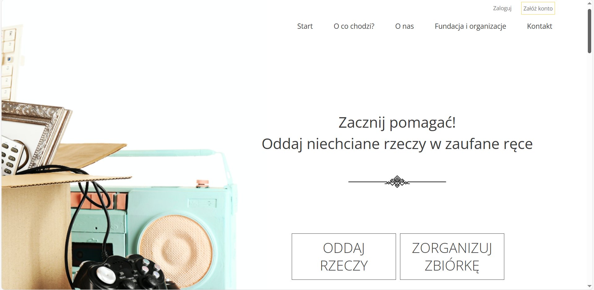
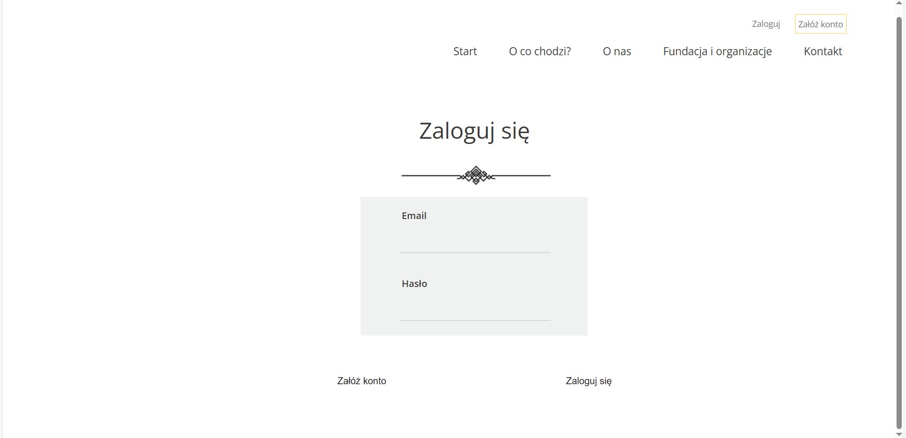
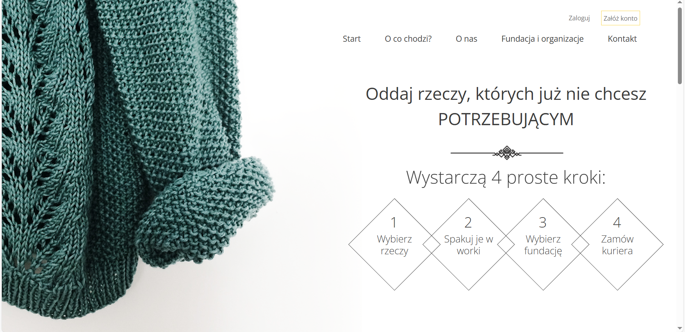
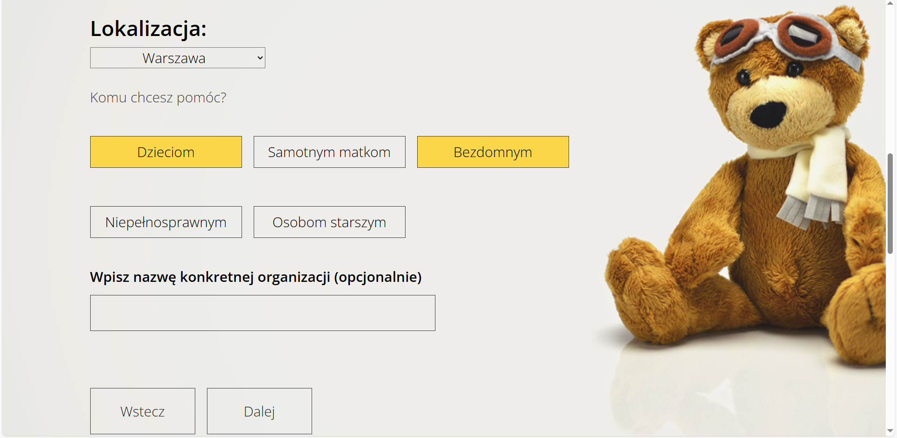

# Second_Hande 

## Table of contents
* [General info](#general-info)
* [Preview](#preview)
* [Technologies](#technologies)
* [Project status](#project-status)
* [Sources](#sources)

## General info
An application that allows you to get rid of unnecessary things and give them a new life. 

Link to the app: https://6697f9b6a5669cfeb112e8de--second-hande.netlify.app/.

## Preview
### Main page - Home

### Main page - Login

### Dashboard

### Dashboard - Form

## Technologies
* JavaScript
* React
* HTML
* SCSS
* Supabase

## Project status
The project is a ready-made application.

## Sources
The application is created based on the Coders Lab project.